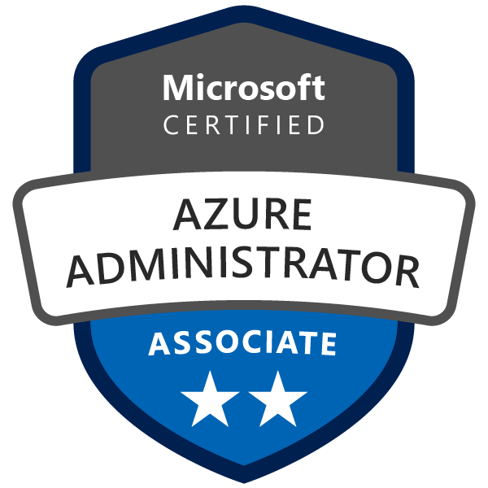
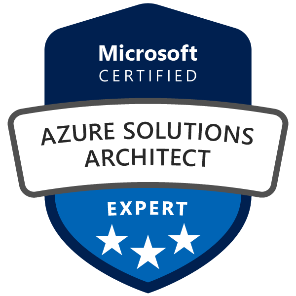
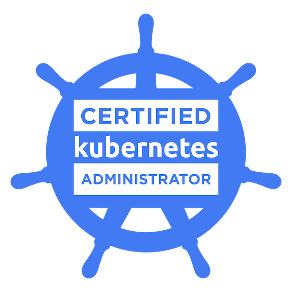
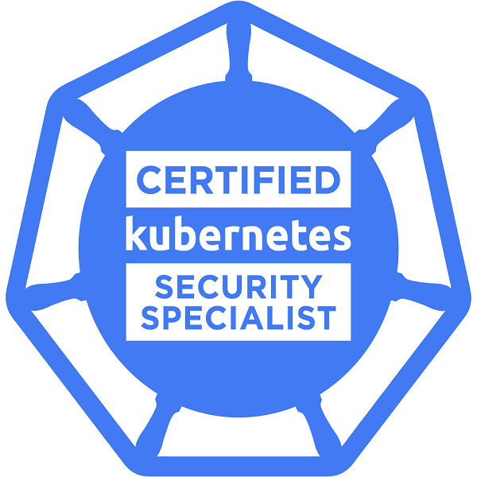
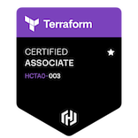
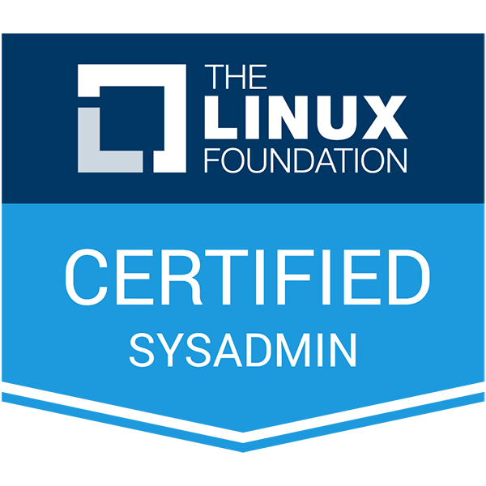

## Hello there 👋

I'm an experienced **DevOps & Cloud Engineer** with expertise in designing, automating, and securing scalable infrastructure.

Currently working at **Lufthansa Group → [DigitalHangar](http://digitalhangar.aero)**, where I focus on *building and maintaining Azure cloud infrastructure through Terraform** and **custom Kubernetes operators to manage Azure resources**.  

- I'm active within the [**SysOps/DevOps Poland**](https://www.sysopspolska.pl) and [**Microsoft Azure User Group Poland**](https://www.meetup.com/pl-PL/microsoft-azure-users-group-poland/) communities
- Separate from work I'm a caring father, runner, reader and enthusiast of innovative technologies.

#### 🛠 My Tech Stack

---

### 🎓 Certifications  
> `Click on images to verify credentials`

  

    
    
    
    
    
    
    
  

---

#### 🚀 Actively seeking new opportunities! Let's connect and talk DevOps!

